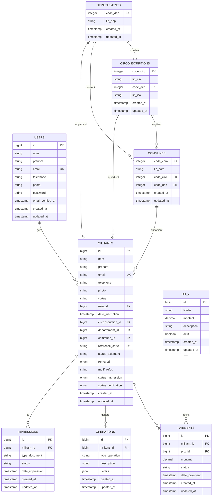

# Documentation Base de Données - Bloc-R

## 🗄️ Vue d'Ensemble

La base de données de Bloc-R est organisée autour de 8 tables principales qui gèrent les militants, les agents, et l'organisation géographique du Bénin.

## 📊 Schéma de la Base de Données



## 📋 Tables Détaillées

### 1. USERS (Agents du parti)

| Champ | Type | Contraintes | Description |
|-------|------|-------------|-------------|
| `id` | bigint | PK, AUTO_INCREMENT | Identifiant unique |
| `nom` | varchar(255) | NOT NULL | Nom de famille |
| `prenom` | varchar(255) | NOT NULL | Prénom |
| `email` | varchar(255) | NOT NULL, UNIQUE | Adresse email |
| `telephone` | varchar(255) | NULL | Numéro de téléphone |
| `photo` | varchar(255) | NULL | Chemin vers la photo |
| `password` | varchar(255) | NOT NULL | Mot de passe hashé |
| `email_verified_at` | timestamp | NULL | Date de vérification email |
| `created_at` | timestamp | NULL | Date de création |
| `updated_at` | timestamp | NULL | Date de modification |

### 2. DEPARTEMENTS (Départements du Bénin)

| Champ | Type | Contraintes | Description |
|-------|------|-------------|-------------|
| `code_dep` | integer | PK | Code du département |
| `lib_dep` | varchar(60) | NOT NULL | Libellé du département |
| `created_at` | timestamp | NULL | Date de création |
| `updated_at` | timestamp | NULL | Date de modification |

**Données de référence :**
- 1 - ALIBORI
- 2 - ATACORA
- 3 - ATLANTIQ.
- 4 - BORGOU
- 5 - COLLINES
- 6 - COUFFO
- 7 - DONGA
- 8 - LITTORAL
- 9 - MONO
- 10 - OUEME
- 11 - PLATEAU
- 12 - ZOU

### 3. CIRCONSCRIPTIONS (Circonscriptions électorales)

| Champ | Type | Contraintes | Description |
|-------|------|-------------|-------------|
| `code_circ` | integer | PK | Code de la circonscription |
| `lib_circ` | varchar(32) | NOT NULL | Libellé de la circonscription |
| `code_dep` | integer | FK → DEPARTEMENTS | Code du département |
| `lib_iso` | varchar(10) | NOT NULL | Code ISO de la circonscription |
| `created_at` | timestamp | NULL | Date de création |
| `updated_at` | timestamp | NULL | Date de modification |

**Contraintes :**
- `circonscriptions_code_dep_foreign` : `code_dep` → `departements.code_dep`

### 4. COMMUNES (Communes municipales)

| Champ | Type | Contraintes | Description |
|-------|------|-------------|-------------|
| `code_com` | integer | PK | Code de la commune |
| `lib_com` | varchar(32) | NOT NULL | Libellé de la commune |
| `code_circ` | integer | FK → CIRCONSCRIPTIONS | Code de la circonscription |
| `code_dep` | integer | FK → DEPARTEMENTS | Code du département |
| `created_at` | timestamp | NULL | Date de création |
| `updated_at` | timestamp | NULL | Date de modification |

**Contraintes :**
- `communes_code_circ_foreign` : `code_circ` → `circonscriptions.code_circ`
- `communes_code_dep_foreign` : `code_dep` → `departements.code_dep`

### 5. MILITANTS (Militants du parti)

| Champ | Type | Contraintes | Description |
|-------|------|-------------|-------------|
| `id` | bigint | PK, AUTO_INCREMENT | Identifiant unique |
| `nom` | varchar(255) | NOT NULL | Nom de famille |
| `prenom` | varchar(255) | NOT NULL | Prénom |
| `email` | varchar(255) | NOT NULL, UNIQUE | Adresse email |
| `telephone` | varchar(255) | NULL | Numéro de téléphone |
| `photo` | varchar(255) | NULL | Chemin vers la photo |
| `status` | varchar(255) | NOT NULL, DEFAULT 'active' | Statut du militant |
| `user_id` | bigint | FK → USERS, NOT NULL | Agent responsable |
| `date_inscription` | timestamp | NOT NULL, DEFAULT CURRENT_TIMESTAMP | Date d'inscription |
| `circonscription_id` | bigint | FK → CIRCONSCRIPTIONS, NOT NULL | Circonscription |
| `departement_id` | bigint | FK → DEPARTEMENTS, NOT NULL | Département |
| `commune_id` | bigint | FK → COMMUNES, NOT NULL | Commune |
| `reference_carte` | varchar(255) | NOT NULL, UNIQUE | Référence de la carte |
| `status_paiement` | varchar(255) | NOT NULL, DEFAULT 'unpaid' | Statut de paiement |
| `removed` | enum('yes','no') | NOT NULL, DEFAULT 'no' | Militant supprimé |
| `motif_refus` | varchar(255) | NULL | Motif de refus |
| `status_impression` | enum('printed','not_printed') | NOT NULL, DEFAULT 'not_printed' | Statut d'impression |
| `status_verification` | enum('en_cours','correct','refuse','corrige') | NOT NULL, DEFAULT 'en_cours' | Statut de vérification |
| `created_at` | timestamp | NULL | Date de création |
| `updated_at` | timestamp | NULL | Date de modification |

**Contraintes :**
- `militants_user_id_foreign` : `user_id` → `users.id` (CASCADE DELETE)
- `militants_circonscription_id_foreign` : `circonscription_id` → `circonscriptions.id` (CASCADE DELETE)
- `militants_departement_id_foreign` : `departement_id` → `departements.id` (CASCADE DELETE)
- `militants_commune_id_foreign` : `commune_id` → `communes.id` (CASCADE DELETE)

### 6. PAIEMENTS (Historique des paiements)

| Champ | Type | Contraintes | Description |
|-------|------|-------------|-------------|
| `id` | bigint | PK, AUTO_INCREMENT | Identifiant unique |
| `militant_id` | bigint | FK → MILITANTS, NOT NULL | Militant concerné |
| `prix_id` | bigint | FK → PRIX, NOT NULL | Type de paiement |
| `montant` | decimal(10,2) | NOT NULL | Montant payé |
| `status` | varchar(255) | NOT NULL | Statut du paiement |
| `date_paiement` | timestamp | NULL | Date du paiement |
| `created_at` | timestamp | NULL | Date de création |
| `updated_at` | timestamp | NULL | Date de modification |

### 7. OPERATIONS (Journal des opérations)

| Champ | Type | Contraintes | Description |
|-------|------|-------------|-------------|
| `id` | bigint | PK, AUTO_INCREMENT | Identifiant unique |
| `militant_id` | bigint | FK → MILITANTS, NOT NULL | Militant concerné |
| `type_operation` | varchar(255) | NOT NULL | Type d'opération |
| `description` | text | NULL | Description de l'opération |
| `details` | json | NULL | Détails supplémentaires |
| `created_at` | timestamp | NULL | Date de création |
| `updated_at` | timestamp | NULL | Date de modification |

### 8. IMPRESSIONS (Gestion des impressions)

| Champ | Type | Contraintes | Description |
|-------|------|-------------|-------------|
| `id` | bigint | PK, AUTO_INCREMENT | Identifiant unique |
| `militant_id` | bigint | FK → MILITANTS, NOT NULL | Militant concerné |
| `type_document` | varchar(255) | NOT NULL | Type de document |
| `status` | varchar(255) | NOT NULL | Statut de l'impression |
| `date_impression` | timestamp | NULL | Date d'impression |
| `created_at` | timestamp | NULL | Date de création |
| `updated_at` | timestamp | NULL | Date de modification |

### 9. PRIX (Tarifs et prix)

| Champ | Type | Contraintes | Description |
|-------|------|-------------|-------------|
| `id` | bigint | PK, AUTO_INCREMENT | Identifiant unique |
| `libelle` | varchar(255) | NOT NULL | Libellé du prix |
| `montant` | decimal(10,2) | NOT NULL | Montant |
| `description` | text | NULL | Description |
| `actif` | boolean | NOT NULL, DEFAULT true | Prix actif |
| `created_at` | timestamp | NULL | Date de création |
| `updated_at` | timestamp | NULL | Date de modification |

## 🔗 Relations et Contraintes

### Relations Principales

1. **USERS → MILITANTS** (1:N)
   - Un agent peut gérer plusieurs militants
   - Suppression en cascade

2. **DEPARTEMENTS → CIRCONSCRIPTIONS** (1:N)
   - Un département contient plusieurs circonscriptions

3. **DEPARTEMENTS → COMMUNES** (1:N)
   - Un département contient plusieurs communes

4. **CIRCONSCRIPTIONS → COMMUNES** (1:N)
   - Une circonscription contient plusieurs communes

5. **MILITANTS → Relations géographiques** (N:1)
   - Un militant appartient à un département, une circonscription et une commune

### Contraintes d'Intégrité

- **Clés étrangères** : Toutes les relations sont protégées par des contraintes FK
- **Suppression en cascade** : Suppression des militants si l'agent est supprimé
- **Unicité** : Email et référence de carte uniques pour les militants
- **Validation** : Statuts limités par des enums

## 📊 Index et Performances

### Index Principaux

```sql
-- Index sur les clés étrangères
CREATE INDEX idx_militants_user_id ON militants(user_id);
CREATE INDEX idx_militants_circonscription_id ON militants(circonscription_id);
CREATE INDEX idx_militants_departement_id ON militants(departement_id);
CREATE INDEX idx_militants_commune_id ON militants(commune_id);

-- Index sur les champs de recherche
CREATE INDEX idx_militants_nom ON militants(nom);
CREATE INDEX idx_militants_prenom ON militants(prenom);
CREATE INDEX idx_militants_email ON militants(email);
CREATE INDEX idx_militants_reference_carte ON militants(reference_carte);

-- Index sur les statuts
CREATE INDEX idx_militants_status ON militants(status);
CREATE INDEX idx_militants_status_paiement ON militants(status_paiement);
CREATE INDEX idx_militants_status_verification ON militants(status_verification);

-- Index géographiques
CREATE INDEX idx_communes_code_circ ON communes(code_circ);
CREATE INDEX idx_communes_code_dep ON communes(code_dep);
CREATE INDEX idx_circonscriptions_code_dep ON circonscriptions(code_dep);
```

## 🌱 Données de Référence

### Seeders Disponibles

1. **DepartementSeeder** : 12 départements du Bénin
2. **CirconscriptionSeeder** : 24 circonscriptions électorales
3. **CommuneSeeder** : 78 communes municipales
4. **PrixSeeder** : Tarifs et prix de référence

### Exécution des Seeders

```bash
# Exécuter tous les seeders
php artisan db:seed

# Exécuter un seeder spécifique
php artisan db:seed --class=DepartementSeeder
php artisan db:seed --class=CirconscriptionSeeder
php artisan db:seed --class=CommuneSeeder
php artisan db:seed --class=PrixSeeder
```

## 🔧 Maintenance et Optimisation

### Requêtes de Maintenance

```sql
-- Vérifier l'intégrité des données
SELECT COUNT(*) FROM militants m
LEFT JOIN users u ON m.user_id = u.id
WHERE u.id IS NULL;

-- Nettoyer les données orphelines
DELETE FROM militants 
WHERE user_id NOT IN (SELECT id FROM users);

-- Statistiques par département
SELECT d.lib_dep, COUNT(m.id) as nb_militants
FROM departements d
LEFT JOIN militants m ON d.code_dep = m.departement_id
GROUP BY d.code_dep, d.lib_dep
ORDER BY nb_militants DESC;
```

### Sauvegarde

```bash
# Sauvegarde complète
mysqldump -u username -p bloc-r > backup_$(date +%Y%m%d_%H%M%S).sql

# Sauvegarde des données uniquement
mysqldump -u username -p --no-create-info bloc-r > data_backup_$(date +%Y%m%d_%H%M%S).sql
```

## 📈 Monitoring et Performance

### Requêtes de Monitoring

```sql
-- Top 10 des agents par nombre de militants
SELECT u.nom, u.prenom, COUNT(m.id) as nb_militants
FROM users u
LEFT JOIN militants m ON u.id = m.user_id
GROUP BY u.id, u.nom, u.prenom
ORDER BY nb_militants DESC
LIMIT 10;

-- Répartition par statut de vérification
SELECT status_verification, COUNT(*) as nombre
FROM militants
GROUP BY status_verification;

-- Évolution des inscriptions par mois
SELECT 
    DATE_FORMAT(created_at, '%Y-%m') as mois,
    COUNT(*) as nouvelles_inscriptions
FROM militants
GROUP BY DATE_FORMAT(created_at, '%Y-%m')
ORDER BY mois DESC;
```

## 🔒 Sécurité

### Bonnes Pratiques

1. **Chiffrement** : Mots de passe hashés avec bcrypt
2. **Validation** : Toutes les entrées sont validées
3. **Sanitisation** : Protection contre les injections SQL
4. **Audit** : Journal des opérations dans la table `operations`
5. **Backup** : Sauvegardes régulières des données

### Contrôles d'Accès

- Authentification requise pour toutes les opérations
- Tokens d'accès avec expiration
- Validation des permissions par agent
- Logs d'audit pour toutes les modifications
